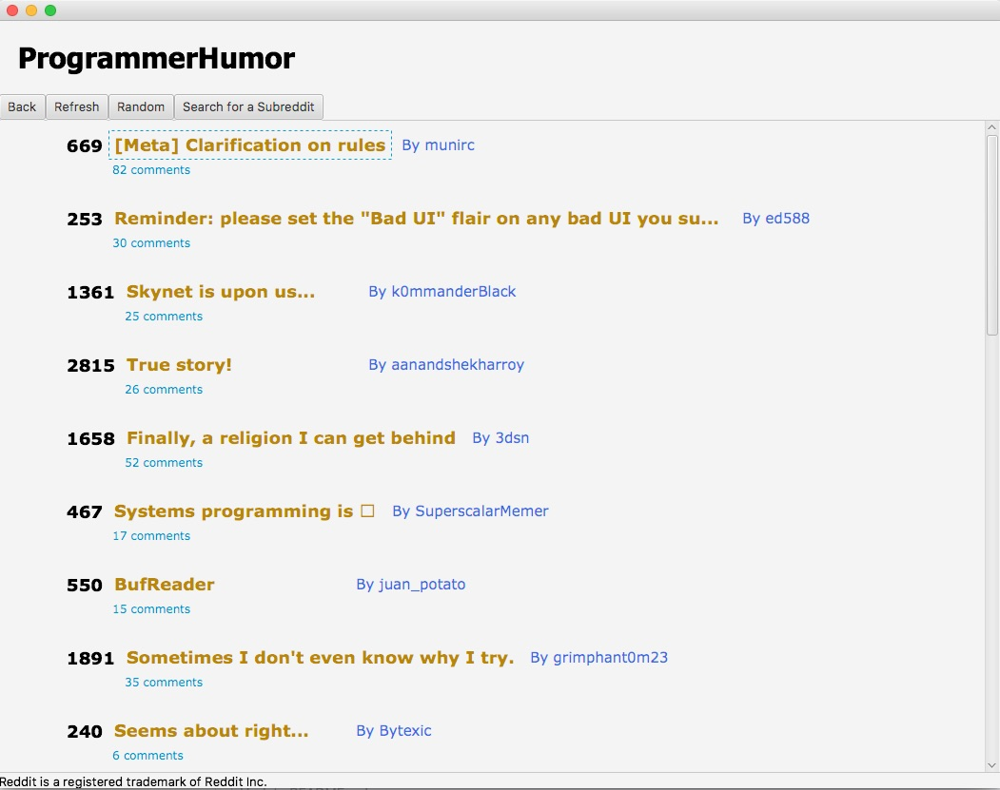

# Abduction for Reddit
### Nathan Mannes, Vermillion Villareal, Thomas Scruggs, Jordan Sybesma

## What Abduction Does:

Abduction is a client for Reddit, one of the most visited web forums on the modern internet.  The program scrapes data from Reddit, notably post content, user data, and comment data, and displays it in an intuitive fashion to the user.  Users can select and view subreddit and post content with an interface designed with good web patterns in mind, catering to beginning users while handling all the content that Reddit has to offer.

## Executing Abduction

First, you will need to install the Jaunt 1.3.8 library.  This is available in the jaunt1.3.8.jar file available on the top level of the repository.  This can be installed in IntelliJ by clicking File > Project Structure, selecting 'Libraries' in the resulting popup, clicking the '+' button, then navigating to the jaunt1.3.8.jar file.

The executable main method for the Abduction client is in the RedditController class.  After excecuting this method, the program will open.

## Known Bugs:

* Closing out of a youtube link while autoplay is enabled results in the video audio playing in the background of the application.  We looked for a fix given that removing all references to the offending Pane object and waiting for garbage collection to take over doesn't seem to work, but unfortunately this issue appears to be inherent to the way JavaFX manages the WebEngine object.

